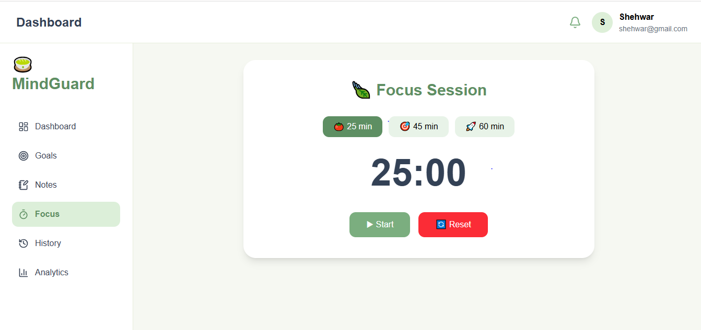
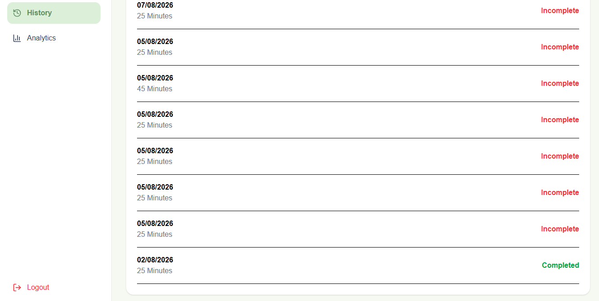

# 🍵 MindGuard

### Stay Focused. Build Better Habits. Achieve More.

A modern MERN Stack productivity platform featuring goal management, Pomodoro focus sessions, analytics, and progress tracking.


## 📖 About

MindGuard is a productivity web application designed to help users improve focus and build consistent habits.

Users can:

- Track daily goals
- Start Pomodoro focus sessions
- View productivity analytics
- Review focus history
- Monitor overall progress through a personalized dashboard

The application follows a clean MERN architecture with secure authentication and responsive UI.

## ✨ Features

✅ User Authentication

✅ Protected Routes

✅ Dashboard

✅ Goal Management

✅ Pomodoro Timer

✅ Focus History

✅ Weekly Analytics

✅ Responsive Design

✅ MongoDB Atlas Database

## 📸 Screenshots

### Signup


---

### Dashboard


---

### Goals


---

### Notes


---

### Focus Timer



---

### History



---

### Analytics


## 🛠 Tech Stack

### Frontend

- React.js
- React Router
- Tailwind CSS
- Axios
- Recharts
- Lucide Icons

### Backend

- Node.js
- Express.js
- MongoDB Atlas
- Mongoose
- JWT Authentication
- bcrypt

### Tools

- Git
- GitHub
- VS Code

## 🚀 Installation

Clone the repository

```bash
git clone https://github.com/Shehwarm/MindGuard.git
```

Backend

```bash
cd backend
npm install
npm run dev
```

Frontend

```bash
cd frontend
npm install
npm run dev
```

## 🚀 Future Enhancements

- AI Productivity Assistant
- Daily Reports
- Monthly Reports
- Email Notifications
- Dark Mode
- Calendar Integration
- Achievement Badges

## 👩‍💻 Author

**Shehwar Maryam**

Software Engineering Student

MERN Stack Developer

GitHub:
https://github.com/Shehwarm

## ⭐ Support

If you enjoyed this project, consider giving it a ⭐ on GitHub.